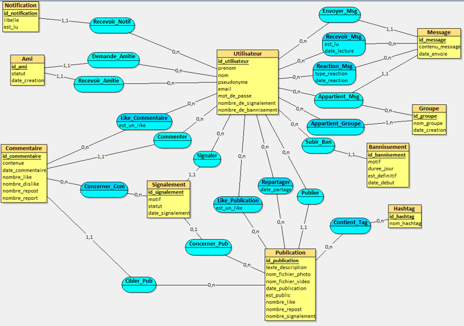
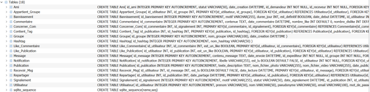

# Documentation sur la Data Base de la SAE 5.02

**Rédigé par DE MENEZES Thomas**

Dans cette documentation nous allons tout d’abord voir notre chemin de réflexion pour la création de la DB, l’application que nous avons utilisés et enfin le schéma final expliqué.

## Découverte de la SAE (Lecture et Discussion)

Lors du début de la SAE moi et Mathias sont partis vers la partie de la DB vu que ceci était notre point fort, au départ j’étais censé m’occuper de la DB utilisateur et lui de la DB photo/vidéo, mais plus tard nous nous sommes rendu compte que la répartition était mal faite au niveau de la DB et on a conclu après cette erreur que c’était plus optimal de faire la tâche « Création de la Data Base globale » à nous deux. Ensuite après cela nous avons commencé à discuter à propos des tables que nous pourrions mettre dans la DB, tel que Utilisateur, Like, Dislike etc., nous avons mis un peu du temps à la faire pour qu’on puisse partir sur une base solide afin d’éviter que nous ayons fait une erreur grave ce qui peut altérer les codes des autres membres du groupe.

## Création de la DB 

Après avoir eu une vague idée de à quoi devrais ressembler la DB nous avons travaillé nous deux sur l’application que Mathias a conseillé qui s’appelle LOOPING (disponible via ce lien), mais quelle est cette application ? Looping est un logiciel gratuit francophone de Modélisation Conceptuelle de Données (MCD) qui sert à concevoir visuellement l'architecture d'une base de données en utilisant la méthode Merise (avec des cases pour les entités, des bulles pour les associations et des cardinalités comme 0,n ou 1,1). Concrètement ça sert à faire une création graphique (on dessiner nos tabes), génération du MLD (en un clic il génère le code après avoir fait le dessin de la conception graphique) puis il fait la génération du SQL en s’adaptant au système cible (type MYSQL, MariaDB, etc.).

Donc en utilisant l’application Looping, Mathias a pu faire une base solide du code SQL (le .txt est présent sur GitHub) puis ensuite nous avons fait les corrections nécessaires dût au fait que l'application contient forcément des petites erreurs. Ensuite nous avons dût rajouter des tables pour les autres membres de notre groupe. J’ai fait du poste par poste pour être sûr à 100% que mes collègues n’avaient pas besoin de modifications supplémentaire (même si la DB reste évolutive bien sûr). C’est que après la séance notre professeur nous avais conseillé de commencer les réunions matinales de 5 à 15min pour savoir ce que fait les autres.

Voici une image illustrative de la création graphique de la DB faite par Mathias :

Ce schéma représente l'architecture globale de notre base de données sous forme de MCD. Il met en évidence :
* Les entités principales (comme Utilisateur, Publication ou Message) avec leurs identifiants uniques.
* Les relations métiers (comme Publier, Commenter, Repartager).
* Les règles de gestion traduites par les cardinalités, permettant de comprendre précisément comment les données interagissent entre elles.

## Transformation du schéma de la DB en code .sql

Ensuite j’ai mis le code SQL de ce schéma sur DB Browser (SQLite), j’ai créé une nouvelle base de données que j’ai nommé database_lifeinvader puis je suis allé dans Vue > Exécuter le SQL et j’ai collé le code que j’avais corrigé au préalable. Puis au final ca ressemblais à ca :

Donc je vais expliquer maintenant la présence des tables présentes dans la DB :

* **Utilisateur :** La table centrale qui stocke les informations de profil (pseudonyme, email, mot de passe sécurisé) et le suivi de la modération à travers le nombre de signalements ou de bannissements reçus.

* **Ami :** Table de liaison indispensable pour interconnecter les utilisateurs (système de followers). Le statut gère l'état de la relation (en attente, validé), et l'utilisation des identifiants (id_demandeur / id_receveur) évite la redondance de texte grâce aux futures jointures.

* **Publication :** Gère les posts de l'application (légende, fichiers photo/vidéo, date). Elle intègre des compteurs de likes, de reposts et de signalements mis à jour dynamiquement pour optimiser l'affichage du flux.

* **Commentaire :** Permet aux utilisateurs de réagir sous les publications. Elle est directement reliée à un auteur et à un post précis, et possède ses propres compteurs (likes/dislikes).

* **Message et Groupe :** Modélisent la messagerie instantanée (Direct Messages). Un message contient le texte et la date, relié à un expéditeur et à un groupe de discussion (qui peut être un groupe à plusieurs ou une conversation privée à deux).

* **Notification :** Alerte un utilisateur en temps réel (nouveau follower, message reçu, etc.). Le booléen est_lu permet de filtrer l'affichage dans l'application.

* **Bannissement et Signalement :** Assurent la modération de la plateforme. Un signalement cible une publication ou un commentaire précis, tandis que la table bannissement archive l'historique et la durée des sanctions appliquées à un profil.

* **Hashtag :** Stocke les mots-clés uniques de la plateforme afin de faciliter la recherche de contenus.

* **Tables d'associations (Like_Publication, Like_Commentaire, Recevoir_Msg, Appartient_Groupe, Contient_Tag, Concerner_Com) :** Ces tables intermédiaires gèrent toutes les relations de type "plusieurs-à-plusieurs". Par exemple, elles permettent de savoir précisément quels utilisateurs ont aimé quel post, qui fait partie de quel groupe, ou quels hashtags sont présents sur une photo, tout en gardant la base de données légère et performante.

La création de la base de données database_lifeinvader marque la fin de la phase de conception technique de notre SAE. En ajustant notre méthode de travail et en communiquant avec notre équipe, nous avons pu corriger nos erreurs de départ pour concevoir un schéma SQLite et une DB propre et prête à l’utilisation pour que nos coéquipiers y fassent bon escient.