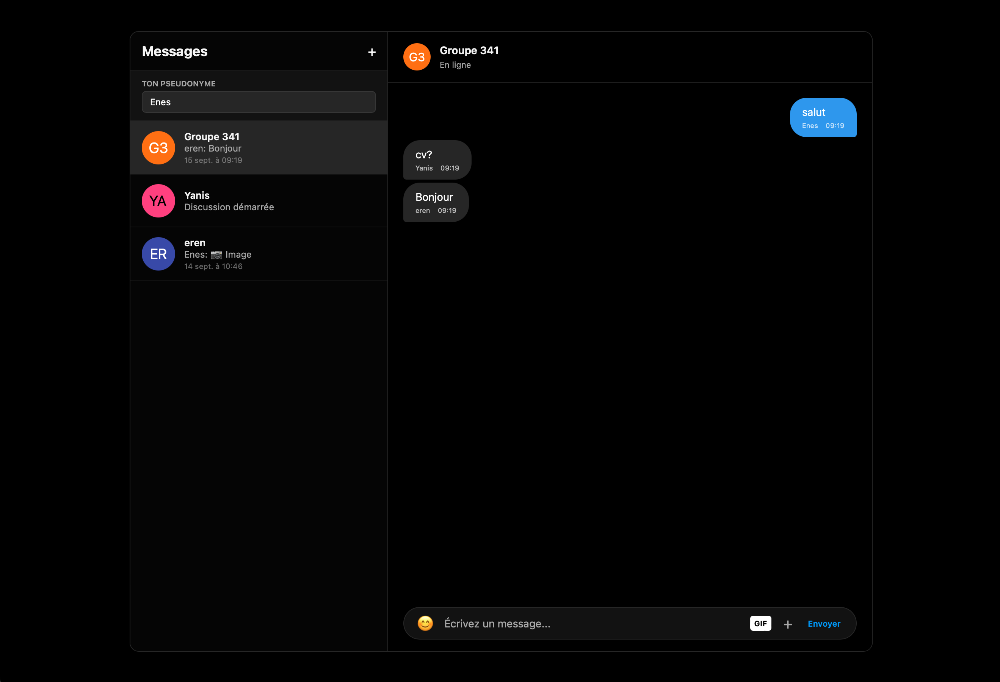
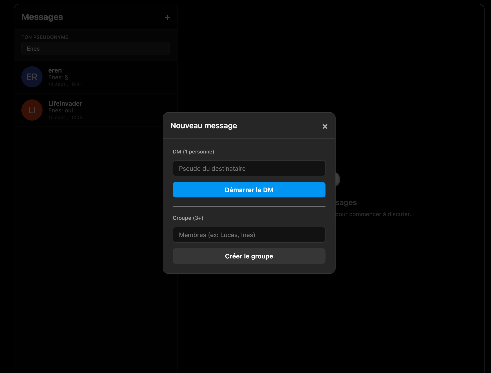
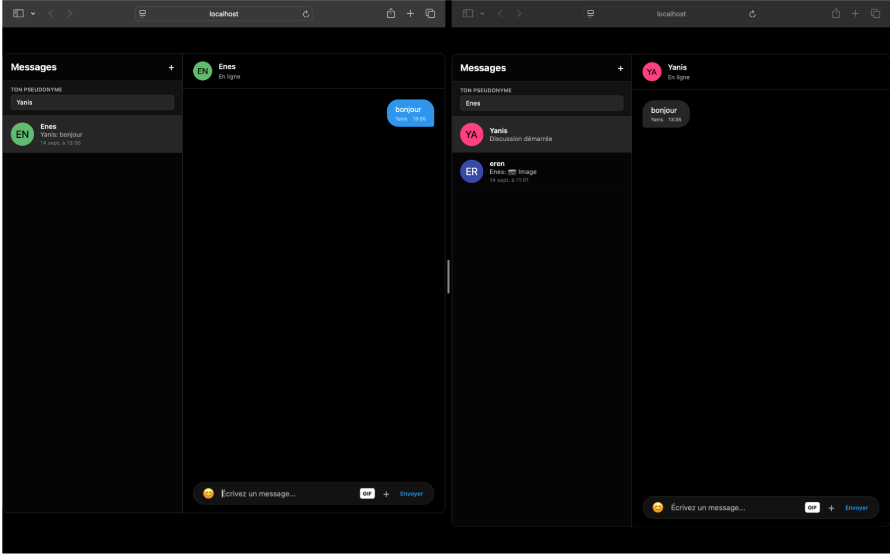
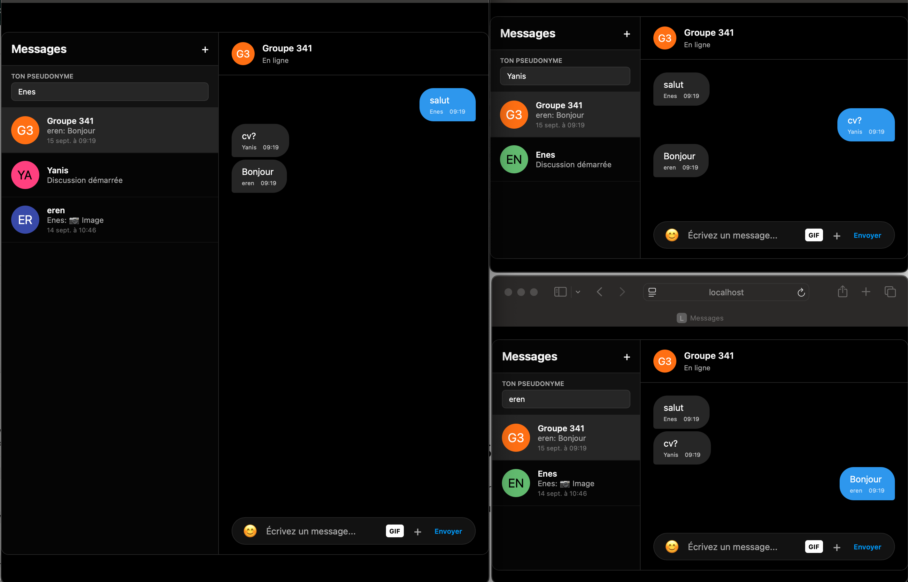
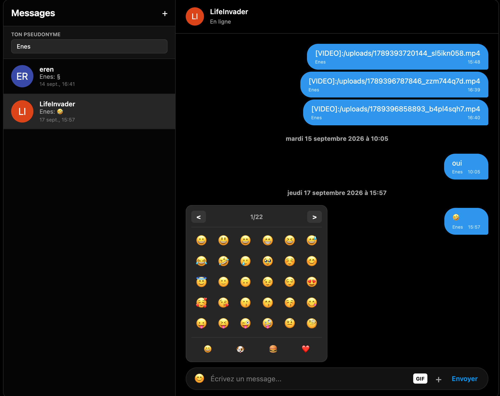
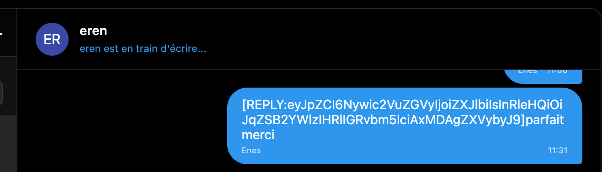
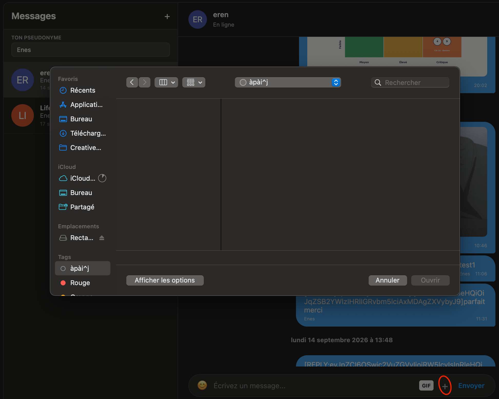
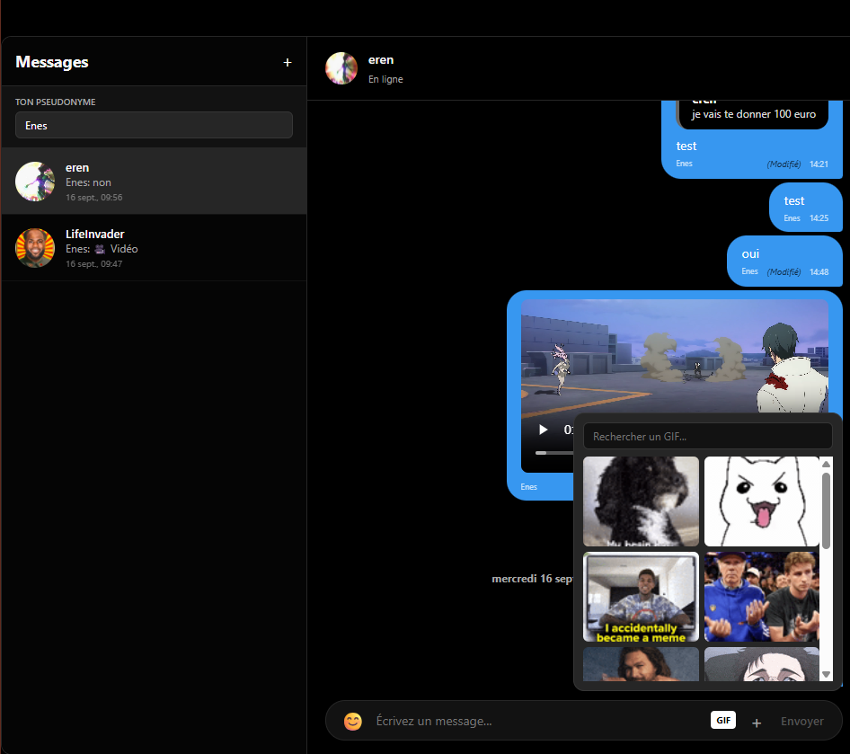

# Procédures de tests

**Responsable** : Enes (Responsable Test)

Tests sur la messagerie:

# Tests fonctionnels de la messagerie

Cette page présente des captures d'écran démontrant le bon fonctionnement des principales fonctionnalités de la messagerie.

## Interface générale

Interface de messagerie fonctionnelle, affichant plusieurs discussions.

## Création de discussion

Interface de création de discussion, permettant de créer une conversation 1 à 1 ou un groupe. Fonctionnel.

## Discussion à deux

Deux personnes sur une discussion : les messages s'envoient et se reçoivent correctement. Fonctionnel.

## Discussion de groupe

Discussion de groupe à trois personnes, fonctionnelle.

## Émojis

Sélecteur et envoi d'émojis fonctionnels.

## Indicateur de frappe

Lorsqu'un utilisateur écrit dans la discussion, la notification « est en train d'écrire » s'affiche.

## Ajout de fichiers

Ajout de fichiers (pièces jointes) fonctionnel.

## GIFs

Recherche et envoi de GIFs fonctionnels.

